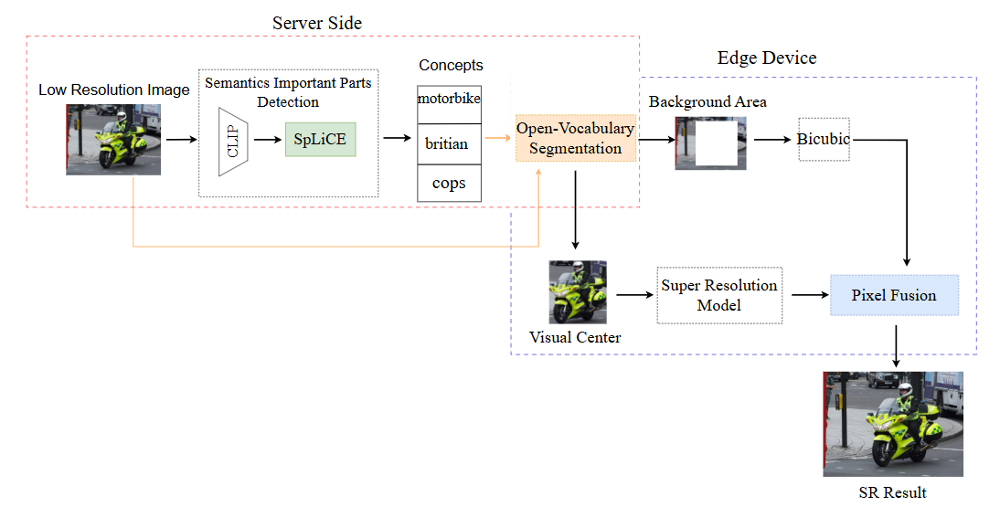

# EdgeSR
南大毕业设计:区域感知的图片超分统一框架，通过识别图片中的视觉重心进行双路超分以达到加速的目的


## 环境
- 下载[GroundingDINO](https://github.com/IDEA-Research/GroundingDINO)，并将其放置在项目根目录
- 下载[SpliCE](https://github.com/AI4LIFE-GROUP/SpLiCE),并将其放置在项目根目录
- 根据requirements.txt 配置其他必须库
- CUDA 11.8, pytorch 2.2.
## 模型下载
权重文件在[这里](https://drive.google.com/file/d/1Jd24TQmv2Jbuo94Uj9joHvmRoKLikXIq/view?usp=sharing),下载后放置在项目根目录。

## 测试数据集
可以在[这里](https://drive.google.com/file/d/11pIWnfasAXKVnqTzmE3vhlj7POvyibNV/view?usp=sharing)下载，包含了BSD100,DIV2K,Manga109,Set14,Urban100经典超分数据集的各类低分辨率图片以及对应高分辨率图片,下载后将其放置在项目根目录即可。

最后的文件结构:
<pre>
|-groundingdino
|-SpLiCE
|-basemodels
|-DRCT
    |-basicSR
    |-DRCT
|-Datasets
    |-BSD100
    |-Set14
    |-Urban100
    |-***
|-项目其他文件
</pre>

## 扩展
只需在sr_models.py里按照BaseSRModel模板类完成自己的超分类；并在sr_fusion完成相应模型的初始化即可。

## 测试
在此之前请先配置好相应的低分辨率图片与对应的grounding truth。然后运行 
```
python experiments.py --model_type SRFormer --sr_model_path basemodels/basicSR/srformer/SRFormer_SRx4_DF2K.pth --scale 4 --lr_dir Datasets/Urban100/image_SRF_4/LR --output_dir $output_dir --hr_dir Datasets/Urban100/image_SRF_4/HR
```


*感谢(BasicSR)[https://github.com/XPixelGroup/BasicSR]， 本文所使用绝大部分模型均在BasicSR框架下运行