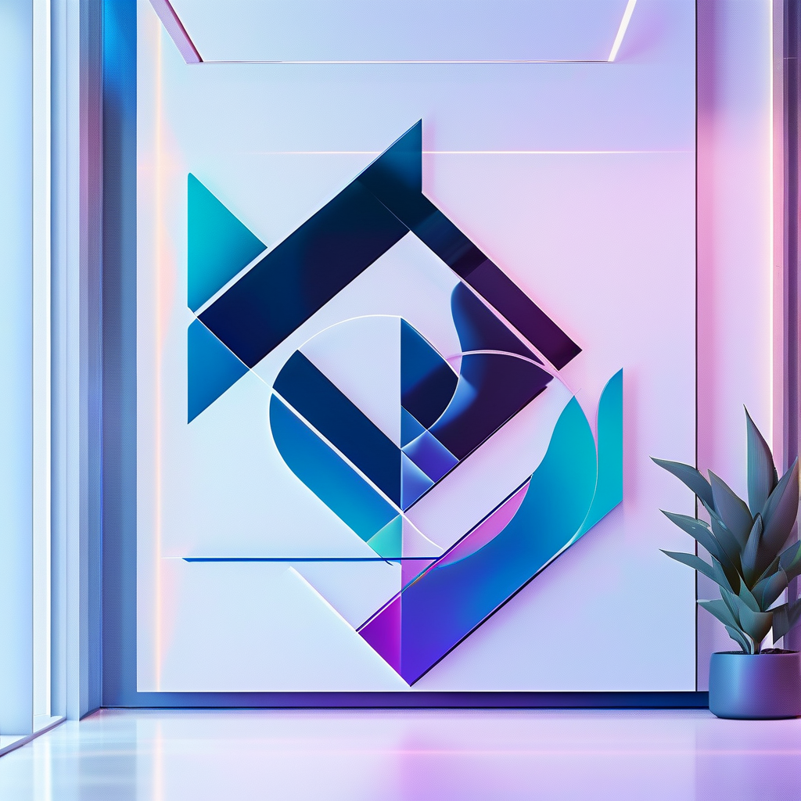

<!-- LANGUAGE SWITCH -->

English | [简体中文](README_CN.md)

<!-- PROJECT POSTER -->

  

---

<!-- PROJECT LOGO -->
 

  <!--  -->

<h3 align="center">EdgeSR</h3>

  

    EdgeSR is an efficient, region-aware image super-resolution framework that prioritizes computational resources on visually significant regions. It combines vision-language models (SpLiCE) and object detection (GroundingDINO) to identify important image regions, applying advanced SR models like HAT and DRCT for targeted enhancement. The system merges SR-upgraded regions with fast interpolation of less important areas, improving both speed and quality. Designed for edge deployment, it supports batch processing, ablation studies, and performance evaluation using PSNR/SSIM metrics.
     
    <a href="https://github.com/Win-commit/EdgeSR"><strong>Explore the docs »</strong></a>
     
  

  <!-- PROJECT SHIELDS -->
[![Contributors][contributors-shield]][contributors-url]
[![Forks][forks-shield]][forks-url]
[![Stargazers][stars-shield]][stars-url]
[![Issues][issues-shield]][issues-url]
[![License][license-shield]][license-url]

  

    <a href="https://github.com/Win-commit/EdgeSR">View Demo</a>
    &middot;
    <a href="https://github.com/Win-commit/EdgeSR/issues/new?labels=bug&template=bug-report---.md">Report Bug</a>
    &middot;
    <a href="https://github.com/Win-commit/EdgeSR/issues/new?labels=enhancement&template=feature-request---.md">Request Feature</a>
  

<!-- TABLE OF CONTENTS -->

  
Table of Contents

  <ol>
    <li>
      <a href="#about-the-project">About The Project</a>
      <ul>
        <li><a href="#built-with">Built With</a></li>
      </ul>
    </li>
    <li>
      <a href="#getting-started">Getting Started</a>
      <ul>
        <li><a href="#prerequisites">Prerequisites</a></li>
        <li><a href="#installation">Installation</a></li>
      </ul>
    </li>
    <li><a href="#usage">Usage</a></li>
    <li><a href="#roadmap">Roadmap</a></li>
    <li><a href="#contributing">Contributing</a></li>
    <li><a href="#license">License</a></li>
    <li><a href="#contact">Contact</a></li>
    <li><a href="#acknowledgments">Acknowledgments</a></li>
  </ol>

<!-- ABOUT THE PROJECT -->
## 📖 About The Project

EdgeSR is an efficient, region-aware image super-resolution framework that prioritizes computational resources on visually significant regions. It combines vision-language models (SpLiCE) and object detection (GroundingDINO) to identify important image regions, applying advanced SR models like HAT and DRCT for targeted enhancement. The system merges SR-upgraded regions with fast interpolation of less important areas, improving both speed and quality. Designed for edge deployment, it supports batch processing, ablation studies, and performance evaluation using PSNR/SSIM metrics.

### Key Features

- **Region-aware Super-resolution**: Identifies and enhances only the most visually significant parts of images, reducing unnecessary computation.
- **Selective Patch Enhancement**: Applies high-quality SR only to detected patches, while background regions are upscaled via interpolation.
- **Visual Concept Detection**: Uses SpLiCE and CLIP to detect important semantic concepts in low-resolution images.
- **Multi-model Support**: Supports various state-of-the-art SR models such as HAT, DRCT, ESRGAN, and more.
- **GPU-accelerated Inference**: Optimized for GPU usage with fallback to CPU, ensuring fast execution on modern hardware.

(<a href="#readme-top">back to top</a>)

### Built With

* [

<!-- MARKDOWN LINKS & IMAGES -->
[contributors-shield]: https://img.shields.io/github/contributors/Win-commit/EdgeSR.svg?style=flat-round
[contributors-url]: https://github.com/Win-commit/EdgeSR/graphs/contributors
[forks-shield]: https://img.shields.io/github/forks/Win-commit/EdgeSR.svg?style=flat-round
[forks-url]: https://github.com/Win-commit/EdgeSR/network/members
[stars-shield]: https://img.shields.io/github/stars/Win-commit/EdgeSR.svg?style=flat-round
[stars-url]: https://github.com/Win-commit/EdgeSR/stargazers
[issues-shield]: https://img.shields.io/github/issues/Win-commit/EdgeSR.svg?style=flat-round
[issues-url]: https://github.com/Win-commit/EdgeSR/issues
[release-shield]: https://img.shields.io/github/v/release/Win-commit/EdgeSR?style=flat-round
[release-url]: https://github.com/Win-commit/EdgeSR/releases
[release-date-shield]: https://img.shields.io/github/release-date/Win-commit/EdgeSR?color=9cf&style=flat-round
[license-shield]: https://img.shields.io/github/license/Win-commit/EdgeSR.svg?style=flat-round
[license-url]: https://github.com/Win-commit/EdgeSR/blob/master/LICENSE.txt

<!-- Tech Stack -->
<!-- 编程语言 -->
[Python]: https://img.shields.io/badge/Python-3776AB?style=flat-round&logo=python&logoColor=white
[Python-url]: https://www.python.org/
[JavaScript]: https://img.shields.io/badge/JavaScript-F7DF1E?style=flat-round&logo=javascript&logoColor=black
[JavaScript-url]: https://developer.mozilla.org/en-US/docs/Web/JavaScript
[TypeScript]: https://img.shields.io/badge/TypeScript-007ACC?style=flat-round&logo=typescript&logoColor=white
[TypeScript-url]: https://www.typescriptlang.org/
[Java]: https://img.shields.io/badge/Java-ED8B00?style=flat-round&logo=openjdk&logoColor=white
[Java-url]: https://www.oracle.com/java/
[Go]: https://img.shields.io/badge/Go-00ADD8?style=flat-round&logo=go&logoColor=white
[Go-url]: https://golang.org/
[Rust]: https://img.shields.io/badge/Rust-000000?style=flat-round&logo=rust&logoColor=white
[Rust-url]: https://www.rust-lang.org/
[C]: https://img.shields.io/badge/C-00599C?style=flat-round&logo=c&logoColor=white
[C-url]: https://en.wikipedia.org/wiki/C_(programming_language)
[CPP]: https://img.shields.io/badge/C++-00599C?style=flat-round&logo=cplusplus&logoColor=white
[CPP-url]: https://en.wikipedia.org/wiki/C%2B%2B
[CSharp]: https://img.shields.io/badge/C%23-239120?style=flat-round&logo=csharp&logoColor=white
[CSharp-url]: https://docs.microsoft.com/en-us/dotnet/csharp/
[MATLAB]: https://img.shields.io/badge/MATLAB-0076A8?style=flat-round&logo=mathworks&logoColor=white
[MATLAB-url]: https://www.mathworks.com/products/matlab.html

<!-- 前端框架 -->
[React.js]: https://img.shields.io/badge/React-20232A?style=flat-round&logo=react&logoColor=61DAFB
[React-url]: https://reactjs.org/
[Vue.js]: https://img.shields.io/badge/Vue.js-35495E?style=flat-round&logo=vuedotjs&logoColor=4FC08D
[Vue-url]: https://vuejs.org/
[Angular.io]: https://img.shields.io/badge/Angular-DD0031?style=flat-round&logo=angular&logoColor=white
[Angular-url]: https://angular.io/
[Next.js]: https://img.shields.io/badge/next.js-000000?style=flat-round&logo=nextdotjs&logoColor=white
[Next-url]: https://nextjs.org/

<!-- 后端框架 -->
[Flask]: https://img.shields.io/badge/Flask-000000?style=flat-round&logo=flask&logoColor=white
[Flask-url]: https://flask.palletsprojects.com/
[Django]: https://img.shields.io/badge/Django-092E20?style=flat-round&logo=django&logoColor=white
[Django-url]: https://www.djangoproject.com/
[FastAPI]: https://img.shields.io/badge/FastAPI-005571?style=flat-round&logo=fastapi&logoColor=white
[FastAPI-url]: https://fastapi.tiangolo.com/
[Express.js]: https://img.shields.io/badge/Express.js-404D59?style=flat-round&logo=express&logoColor=white
[Express-url]: https://expressjs.com/
[Spring]: https://img.shields.io/badge/Spring-6DB33F?style=flat-round&logo=spring&logoColor=white
[Spring-url]: https://spring.io/
[Node.js]: https://img.shields.io/badge/Node.js-43853D?style=flat-round&logo=node.js&logoColor=white
[Node-url]: https://nodejs.org/

<!-- AI/ML 相关 -->
[OpenAI]: https://img.shields.io/badge/OpenAI-000000?style=flat-round&logo=openai&logoColor=white
[OpenAI-url]: https://openai.com/
[Rich]: https://img.shields.io/badge/Rich-000000?style=flat-round&logo=rich&logoColor=white
[Rich-url]: https://rich.readthedocs.io/

<!-- 数据库 -->
[PostgreSQL]: https://img.shields.io/badge/PostgreSQL-316192?style=flat-round&logo=postgresql&logoColor=white
[PostgreSQL-url]: https://www.postgresql.org/
[MySQL]: https://img.shields.io/badge/MySQL-00000F?style=flat-round&logo=mysql&logoColor=white
[MySQL-url]: https://www.mysql.com/
[MongoDB]: https://img.shields.io/badge/MongoDB-4EA94B?style=flat-round&logo=mongodb&logoColor=white
[MongoDB-url]: https://www.mongodb.com/
[Redis]: https://img.shields.io/badge/Redis-DC382D?style=flat-round&logo=redis&logoColor=white
[Redis-url]: https://redis.io/
[SQLite]: https://img.shields.io/badge/SQLite-07405E?style=flat-round&logo=sqlite&logoColor=white
[SQLite-url]: https://www.sqlite.org/
